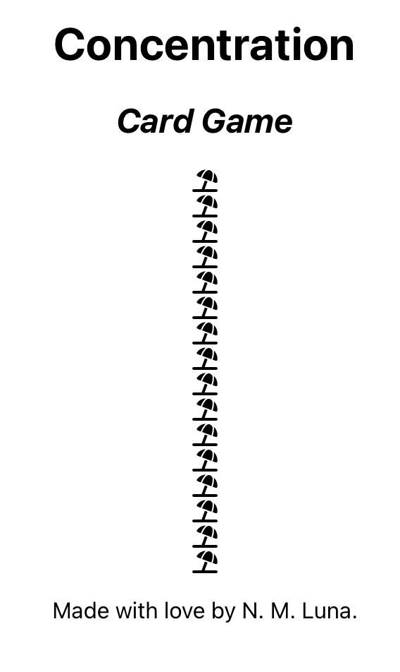

# Building the Concentration app

Plan:
1. Make a working draft
2. Create components
3. Make the cards flip by clicking
4. Create a deck and shuffle the cards

## I. Make a working draft

I create a React app called 'concentration' with the following line.

`$ npx create-react-app concentration`


### 1. Create components.

Directly in my App, I put the three big components of my app: 

- The top banner (displays the title of the game)
- The game board (displays the deck of cards)
- The footer (displays the author's name and the date)

After adding these three components, my (*oh so bare*) App.JS consists of the 16 following lines.

```
import './App.css';
import TopBanner from './TopBanner';
import GameBoard from './GameBoard';
import Footer from './Footer';

function App() {
  return (
    <div className="App">
      <TopBanner />
      <GameBoard />
      <Footer />
    </div>
  );
}
export default App;
```

And each of the three component JS files looks something like this:

```
import React from 'react';

function ComponentName() {
    return(
        <div className='onlyOneElementAllowedHere'>
        </div>
    )
}

export default ComponentName;
```

Now is a good time for a first commit. 

`$ git add .`

`$ git commit -m "add three main components"`

The other component that I need for my first draft is the `Card` component. In the `GameBoard` component, I'm currently returning a `div` with a placeholder `p`. I replace the `p` element with 16 identical `Card` components.

There are two parts to this:

First part is to build an array of `Card` components in the GameBoard component.


```
//Create a deck
    const difficulty = 16
    const deck = [] 
    for (let i = 0; i < difficulty; i++) {
        deck.push(<Card key={i} />);
    }
```

And dumping that array in the div that the `GameBoard` function returns.
```
return(
    <div>
        {deck}
    </div>
)
```

Second part is to write a new file for the `Card` component. This will be a div which will show either the card back (the deck logo) or the card face (a FontAwesome icon). 

For now, every `Card` will display one icon; a beach umbrella because beaches are cool. I tred to display the icons by installing an npm package and rendering a FontAwesome component. That did not work after a few tries; so I'm doing it by adding the CDN `link` tag in index.HTML and rendering a `span` tag in the `Card` component.



This is what my app looks like at the moment. The cards look nothing like I will want them to, but CSS comes later. I just need everything to render without bugs.

Because it does, let's save and continue working on the Card component and some layouts.

`$ git commit -m "add Card component"`

