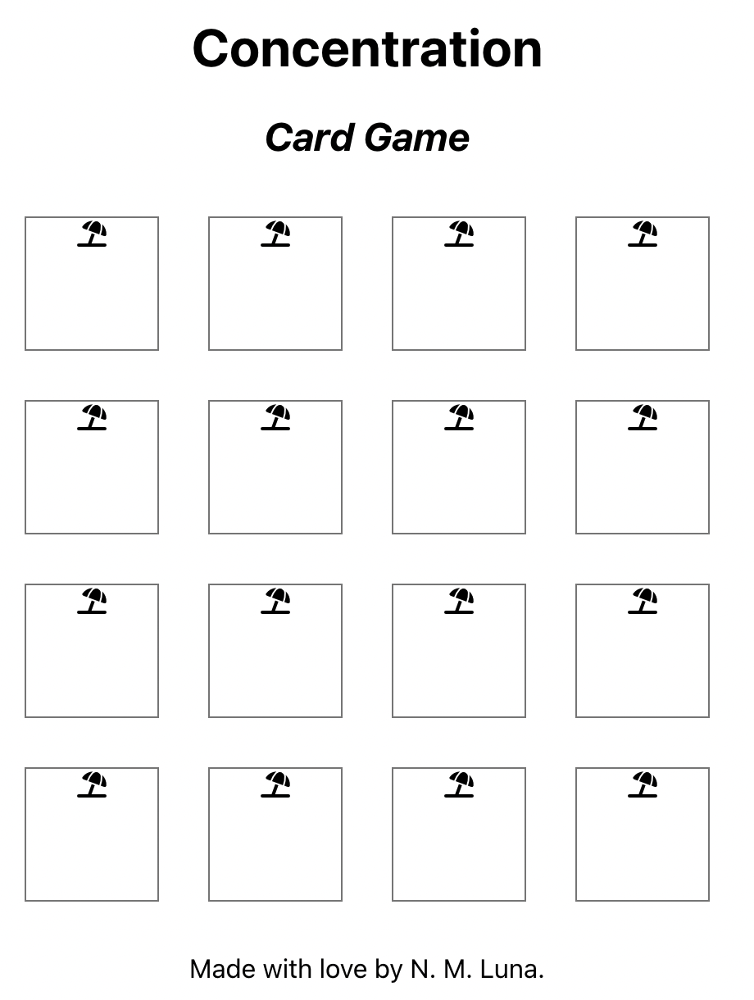
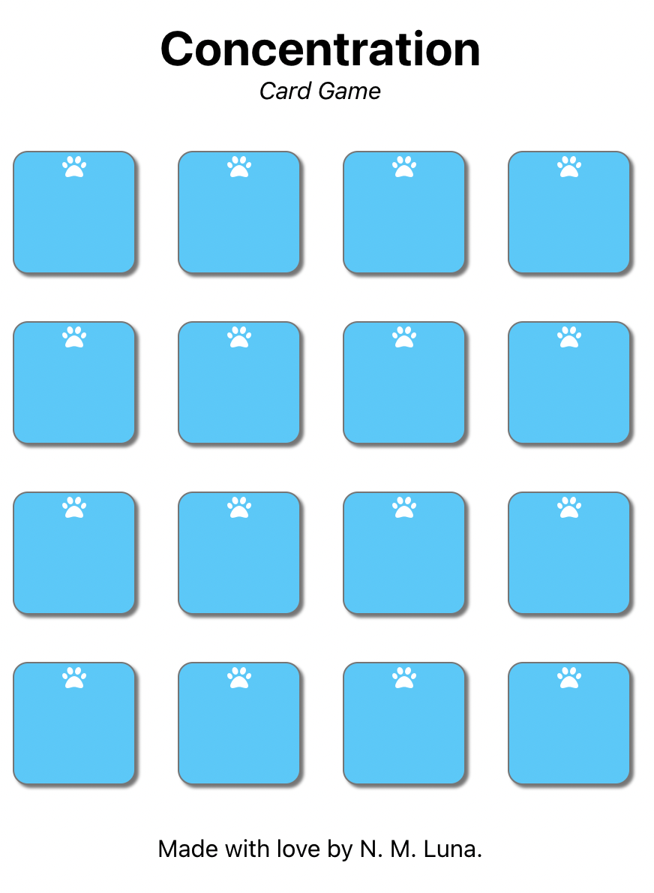

# Building the Concentration app

Plan:

**Step 1**. Make a working draft

  1. Create components
  2. Make the cards flip by clicking
  3. Create a deck and shuffle the cards

**Step 2**. Implement game logic. 

  1. After the user clicks on two cards, we need to count the turn and then one of two things happen. Either the cards match and we update the status of those two cards as "solved"; or they don't match and we flip them back.
  2. When all the cards in the deck have been solved, send an alert with the player's score.

**Step 3**. Use `Routes` to add a start game route and a game over route. The start game route is just a button to start the game. And the game over route displays the player's score (i.e., number of turns) and has a button to play again.

**Step 4**. Make a deck menu where the player can change between decks.

**Step 5**. Add in the extras.

1. Social icons in the footer.
2. User can change levels. 
3. Browser remembers highest score. 
4. User can sign in to keep a record of their highest score.
5. User can share their score in social media.

## Step 1. Make a working draft

I create a React app called 'concentration' with the following line.

`$ npx create-react-app concentration`


### 1. Create components.

Directly in my App, I put the three big components of my app: 

- The top banner (displays the title of the game)
- The game board (displays the deck of cards)
- The footer (displays the author's name and the date)

After adding these three components, my (*oh so bare*) App.JS consists of the 16 following lines.

```
import './App.css';
import TopBanner from './TopBanner';
import GameBoard from './GameBoard';
import Footer from './Footer';

function App() {
  return (
    <div className="App">
      <TopBanner />
      <GameBoard />
      <Footer />
    </div>
  );
}
export default App;
```

And each of the three component JS files looks something like this:

```
import React from 'react';

function ComponentName() {
    return(
        <div className='onlyOneElementAllowedHere'>
        </div>
    )
}

export default ComponentName;
```

Now is a good time for a first commit. 

`$ git add .`

`$ git commit -m "add three main components"`

The other component that I need for my first draft is the `Card` component. In the `GameBoard` component, I'm currently returning a `div` with a placeholder `p`. I replace the `p` element with 16 identical `Card` components.

There are two parts to this:

First part is to build an array of `Card` components in the GameBoard component.


```
//Create a deck
    const difficulty = 16
    const deck = [] 
    for (let i = 0; i < difficulty; i++) {
        deck.push(<Card key={i} />);
    }
```

And dumping that array in the div that the `GameBoard` function returns.
```
return(
    <div>
        {deck}
    </div>
)
```

Second part is to write a new file for the `Card` component. This will be a div which will show either the card back (the deck logo) or the card face (a FontAwesome icon). 

For now, every `Card` will display one icon; a beach umbrella because beaches are cool. I tred to display the icons by installing an npm package and rendering a FontAwesome component. That did not work after a few tries; so I'm doing it by adding the CDN `link` tag in index.HTML and rendering a `span` tag in the `Card` component.


This is what my app looks like at the moment. The cards look nothing like I will want them to, but CSS comes later. I just need everything to render without bugs.

Because it does, let's save and continue working on the Card component and some layouts.

`$ git commit -m "add Card component"`

Next step is to make the cards flippable. But before that, I wanted to do some light editing to the style and layout. I'm arranging the Cards in rows for four by wrapping Cards in `div` containers in groups of four. 

This **did not** work because each `Card` component returns a `div`. I will need this `div` container later on, so I'm going to make it display as a block element. Via className, I'm adding these CSS properties to the `Card`

```
  border: 1px solid gray;
  display: inline-block;
  height: 80px;
  margin: 15px;
  width: 80px;
```

I'm also adding some bulk to each card, I can see if my attempt to flip the cards is working. 



I'm now ready for another savepoint.

`$ git commit -m "edit Card component and GameBoard layout`

### 2. Make the cards flip by clicking

Following [this tutorial](https://www.w3schools.com/howto/howto_css_flip_card.asp), I re-wrote the `Card` component so that the cards flip over whenever the user clicks on them. This component now returns these nested `div`s:

```
<div className='card-slot'>
  <div className='card'>
    <div className='card-logo'>
      <span className='fa-solid fa-sun' />
    </div>
    <div className='card-face'>
      <span className="fa-solid fa-umbrella-beach" />
    </div>
  </div>
</div>
```

The top-most `div` sets the height and width of the cards. I already have some style on the `.card-slot div`. These are the new lines that are nbeing added for the flipping animation.

```
.card-slot {
  background-color: transparent;
  perspective: 1000px;
}
```

The next `div` is "the actual card" and it contains two `div`s, one for each face of the card. To implement the flip animation, this `div` wraps around both faces of the card and has a relative position. Also in this `div`, I'm specifying what type of transition is displays(?), how long it should take, and what style it should be.

```
.card {
  height: 100%;
  position: relative;
  transform-style: preserve-3d;
  transition: transform 0.8s;
  width: 100%;
}
```

Both "sides" of the `.card div` should have an absolute position and take up 100% of its parent `div`. Here, I'm also specifying that the backface is hidden.

```
.card-logo, .card-face {
  backface-visibility: hidden;
  border: 1px solid gray;
  color: white;
  height: 100%;
  position: absolute;
  width: 100%;
  -webkit-backface-visibility: hidden; /* Safari */
}
```

Now the Card component is set up for flipping action. At this point, I added some more cosmetic CSS properties.

The last of the CSS (for the flipping animation)are two transform properties. One goes on the side of the card that's going to be facing down:

```
.card-face {
  transform: rotateY(180deg);
}
```

And the other transform property goes in a separate class that will be applied to the `.card div` when the user/player clicks on the card.

```
.flipped-card {
  transform: rotateY(180deg);
}
```

When the user clicks on a card, I want to execute a function that flips the card; i.e., that adds the `.flipped-card` class to the `.card div`. 

```
 <div className='card-slot' onClick={flipCard}>
```

I'm using the react hook `useState` so the Card component remembers if it's flipped or not. So the flipCard function just calls the setFlipped function.

```
import { useState } from 'react';

function Card() {
  const [isFlipped, setFlipped] = useState(false);

  const flipCard = () => {
    setFlipped(!isFlipped);
  };
    
  return (...)
}
```
Finally, the `.card div` will get the `.card` class always and the `.flipped-card` only when the status isFlipped is true. I'm using the terciary 

```
<div className={isFlipped? 'card flipped-card' : 'card'}>
```


### 3. Create a deck and shuffle the cards

Time to build a deck! Right now, the app is rendering 16 cards with a beach umbrella icon. Browsing [www.fontawesome.com](https://fontawesome.com/icons/), I compiled this list of card faces to use:

- 'fa-solid fa-hippo'
- 'fa-solid fa-fish'
- 'fa-solid fa-otter'
- 'fa-solid fa-kiwi-bird'
- 'fa-solid fa-worm'
- 'fa-solid fa-spider'
- 'fa-solid fa-shrimp'
- 'fa-solid fa-mosquito'
- 'fa-solid fa-locust'
- 'fa-solid fa-horse'
- 'fa-solid fa-frog'
- 'fa-solid fa-dove'
- 'fa-solid fa-dog'
- 'fa-solid fa-crow'
- 'fa-solid fa-cow'
- 'fa-solid fa-cat'

These are from the animals icon collection. An appropriate deck logo is the 'fa-solid fa-paw' icon. I'm putting these strings in a separate file called deckLibrary.JS and, right now, it only has an "animalDeck" object:

```
const animalDeck = {
    logo: 'fa-solid fa-paw',
    faces: [
        'fa-solid fa-hippo',
        ...
    ]
}
export {animalDeck};
```

Now that I have a deck object, what do I do with it? How do I get it to display in the Card components?

The GameBoard component is where the Card components are created. So this is where the app will access this deck object, shuffle the faces, and pass it as props to the Card component.

In the GameBoard.JS file, I'm importing the deck object:

```
import { animalDeck } from './deckLibrary.js';
```

And *inside* the GameBoard function body, I'm adding these lines to crete the props that will be passed onto the Card components.

```
//Grab a deck from the library
const deckLogo = animalDeck.logo
const deckFaces = fyShuffle(animalDeck.faces).slice(0,difficulty)
```

The "fyShuffle" function is my own, based on [Durstenfeld's version of the Fischer-Yates shuffle](https://en.wikipedia.org/wiki/Fisher%E2%80%93Yates_shuffle#The_modern_algorithm) algorithm. 

```
function fyShuffle(arr) {
    let j, temp
    let shuffledArray = arr

    for (let i=arr.length-1; i>0; i--) { //For every i from array.length-1 until 1,
        j = Math.floor(Math.random()*i) //Pick a number between 0 and i-1, and
        temp = shuffledArray[j]
        shuffledArray[j] = shuffledArray[i]
        shuffledArray[i] = temp //Swap the i-th and the j-th elements.
    }

    return shuffledArray;
}
```

Now that the GameBoard has created/copied a deckLogo and an array of deckFaces, I can pass them as props to the Card components.

```
<Card key={i} logo={deckLogo} face={deckFaces[i]} />
```

Inside the Card component, I can receive these props.

```
function Card({logo, face}) {...}
```

And finally, use these two props as the className in the appropriate `span` tags. The app runs as expected. Every time the page is loaded, the deck is rendered in a different (random) order.


Time for a save point!

`$ git commit -m "add and shuffle the deck"`

Before I start implementing the game logic, let's add a little bit of CSS. Here is what the app looks like after I decresed some vertical space in the TopBanner component and added rounded corners and box shadows in the Card components.



I'm ready to save and continue on to the next part of development.

`$ git commit -m "add some style"`

## Step 2. Implement game logic. 

Define game play and write pseudo-code.

### 1. onClick function

After the user clicks on two cards, we need to count the turn and then one of two things happen. Either the cards match and we update the status of those two cards as "solved"; or they don't match and we flip them back.

### 2. Game over

When all the cards in the deck have been solved, send an alert with the player's score.

## Step 3. Routes

Use `Routes` to add a start game route and a game over route. The start game route is just a button to start the game. And the game over route displays the player's score (i.e., number of turns) and has a button to play again.

## Step 4. Deck menu

Make a deck menu where the player can change between decks.

## Step 5. The extras and nice-to-haves

### 1. Social icons in the footer.

### 2. User can change levels. 

### 3. Browser remembers highest score. 

### 4. User can sign in to keep a record of their highest score.

### 5. User can share their score in social media.
